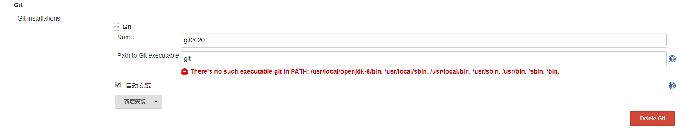
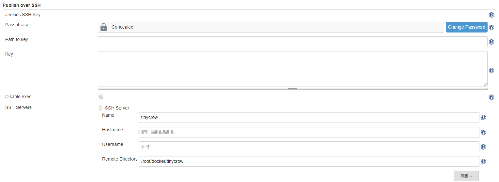

# Springboot2.x 依赖 Jenkins 和 Github 持续集成（1）

> 1. `系统管理` `全局工具配置` 配置

> 配置 `JDK`

- 设置 `JDK别名`
- 勾选 `自动安装`
- 勾选 `我同意 Java SE Development Kit 的许可协议`
- 选择版本 `Java SE Development Kit 8u221`
- 点击 `Please enter your username/password` 输入 `Oracle` 账号密码

> 配置 `Git`

- 自定义 `Git Name`
- 勾选 `自动安装`

> 配置 `Maven`

- 自定义 `Maven Name`
- 勾选 `自动安装`

> 选择安装最新版本

- 配置 `Docker`
- 自定义 `Docker Name`
- 勾选 `自动安装`

> 以上内容配置完成后，点击 `应用`，再点击 `保存`

> 2. 安装插件

- `Maven Integration` （`Maven`构建插件）

- `Pipeline Maven Integration`（`Maven`构建插件）

- `Git Parameter` ( 用于参数化构建中动态获取项目分支 )

- `Generic Webhook Trigger` ( 用于解析 `Webhook` 传过来的参数 )

- `Publish Over SSH` （用于传输文件到远程服务器）

- `Github Plugin` (会自己安装相关的依赖)

> 3. `Jenkins` 生成 `Hook URL`

- 进入 `Jenkins` `系统管理` `系统配置` 找到 `GitHub` 模块，点击 `高级`

- 勾选 `为 Github 指定另外一个 Hook URL`

- 复制 `Hook URL` `http://121.136.128.11:8081/github-webhook/`

> 4. 登录 `Github` ,获取项目写的权限

- 进入`github` -> `Settings` -> `Developer settings` -> `Personal Access Token` -> `Generate new token`
- 保存 `token`

> 5. `Github webhooks` 设置

- 进入`GitHub`指定的项目 -> `setting` -> `WebHooks&Services` -> `add webhook`
- 在 `Payload URL `输入刚刚`jenkins`的 `Hook URL`
- 并且选择 `Let me select individual events` ，勾选 `Pushes`
- 点击 `Add webhooks` 完成

> 6. 添加 `GitHub Server` 配置

- 自定义名称\

- 凭据 `添加` 选择 `jenkins`
- 弹出界面 `类型` 选择 `Secret text`
- `Secret` 输入在 `GitHub` 生成的 `token`
- 点击 `添加`
- 选 `管理 Hook`
- 凭据选择 `Secret text` 点击 `连接测试`

> 7. 添加 `ssh 远程服务器`

- `系统管理` - `系统配置` - 最下方有个 `Publish over SSH`
- `Passphrase` 输入服务器登录密码
- 新增 `SSH Service` 输入服务器信息
- `Remote Directory` 输入 `/root/docker/tinycrow`
- 点击 `测试连接` 成功

