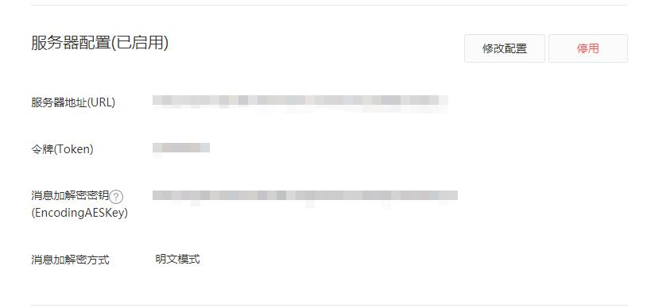

# 微信公众号后台开发教程

---

## 1. 接入微信公众平台开发

> 填写服务器配置

登录微信公众平台官网后，在公众平台官网的开发-基本设置页面，勾选协议成为开发者，点击“修改配置”按钮，填写服务器地址（URL）、Token和EncodingAESKey，其中URL是开发者用来接收微信消息和事件的接口URL。Token可由开发者可以任意填写，用作生成签名（该Token会和接口URL中包含的Token进行比对，从而验证安全性）。EncodingAESKey由开发者手动填写或随机生成，将用作消息体加解密密钥。



*微信公众号的所有是配置的接入URL,如果GET请求，是校验信息是否微信服务器发送，如果是POST请求，则是微信公众号的其他操作入口，如消息/菜单点击/订阅/取消订阅等。*

> 验证服务器地址的有效性

开发者提交信息后，微信服务器将发送GET请求到填写的服务器地址URL上，GET请求携带参数如下表所示：

参数|描述
-|-
signature|微信加密签名，signature结合了开发者填写的token参数和请求中的timestamp参数、nonce参数。
timestamp|时间戳
nonce|随机数
echostr|随机字符串

**按以下加密/校验流程规则校验，与signature对比，相同则确认该GET请求来源于微信服务器，需要原样返回echostr参数，则接入生效：**

* 1）将token、timestamp、nonce三个参数进行字典序排序
* 2）将三个参数字符串拼接成一个字符串进行sha1加密
* 3）开发者获得加密后的字符串可与signature对比，标识该请求来源于微信

JAVA参考代码：

```java

/**
 * 微信公众号认证接口
 *
 * @param request
 */
@GetMapping("entrance")
public String qkdEntrance(HttpServletRequest request) {
    String echostr = request.getParameter("echostr");
    if (auth(request)) {
        // 认证成功，原样返回echostr
        return echostr;
    }
    // 认证失败
    return "";
}

/**
 * 验证微信配置参数是否成功
 *
 * @return true : 一致
 *         false: 不一致
 */
private boolean auth(HttpServletRequest request) {
    String signature = request.getParameter("signature");
    String timestamp = request.getParameter("timestamp");
    String nonce = request.getParameter("nonce");
    String[] arr = new String[]{configToken, timestamp, nonce};
    // 排序
    Arrays.sort(arr);
    // 生成字符串
    StringBuilder sb = new StringBuilder();
    for (int i = 0; i < arr.length; i++) {
        sb.append(arr[i]);
    }
    // sha1加密
    String temp = DigestUtils.sha1Hex(sb.toString());
    // 与微信传的参数是否一致校验
    return temp.equals(signature);
}
```

## 配置回调白名单IP

在微信公众号基本配置的公众号开发信息快中，添加白名单IP，获取`access_token`接口才可调用成功。

## 创建公众号菜单接口

POST方式向`https://api.weixin.qq.com/cgi-bin/menu/create?access_token=ACCESS_TOKEN`发送菜单json串即可。

```java
/**
* 创建菜单接口
*
* @param json 菜单json
* @return
*/
@Override
public void createMenu(String json) {
    // 获取token
    String token = AccessTokenUtil.getAccessToken();
    // 发送post请求
    try {
        HttpUtil.post(WxConstants.CREATE_MENU_URL.replace(WxConstants.ACCESS_TOKEN, token), json);
        log.info("创建微信公众号菜单接口被调用，菜单json:{}", json);
    } catch (IOException e) {
        log.error("调用创建微信公众号菜单出错，异常信息:{}", e);
        throw new RuntimeException("调用创建微信公众号菜单出错", e);
    }
}
```

菜单json举例：

```json
{
  "button": [
    {
      "type": "view",
      "name": "首页",
      "url": "http://qukanbao.qukandian573.com/login?type=1"
    },
    {
      "type": "view",
      "name": "保险学院",
      "url": "http://qukanbao.qukandian573.com/login?type=2"
    },
    {
      "type": "view",
      "name": "产品列表",
      "url": "http://qukanbao.qukandian573.com/login?type=3"
    }
  ]
}
```

## 授权跳转网页

> 菜单入口配置

以上述配置的首页为例，点击菜单，跳转服务器端的入口，根据不同的入口设置不同的回调地址

回调地址`https://open.weixin.qq.com/connect/oauth2/authorize?appid=APPID&redirect_uri=REDIRECT_URI&response_type=code&scope=snsapi_userinfo&state=STATE#wechat_redirect`,其中的`REDIRECT_URI`替换为需要跳转的前端地址。

```java
/**
* 公众号菜单点击入口
*/
@RequestMapping("login")
public void helloThymeleaf(HttpServletRequest request, HttpServletResponse response) {
    String appid = paramService.getParamValueByKey(WxConstants.WX_APPID_CONFIG);
    // 菜单分类
    String type = request.getParameter("type");
    // 设置回调地址
    String callBackUrl = redirectTypeUrl(type);
    String url = WxConstants.TO_AUTH_URL.replace(WxConstants.APP_ID, appid)
            .replace(WxConstants.REDIRECT_URI, callBackUrl).replace(WxConstants.STATE, type);
    log.info("授权跳转地址：{}", url);
    try {
        response.sendRedirect(url);
    } catch (IOException e) {
        log.error("[微信公众号获取授权操作时，转发跳转授权页面出错]++异常信息：{}", e);
        throw new RuntimeException("[微信公众号获取授权操作时，转发跳转授权页面出错]", e);
    }
}
```

前端获取请求路径的`code`和`state`两个参数,利用state决定跳转那个页面，并向后端发送`GET`请求，获取用户信息。

> 通过code换取网页授权access_token

后端接收`code`，微信服务器获取网页授权`access_token`,其中包含了

```java
/**
* 通过code获取用户信息
*
* @param code 微信公众号授权code
* @return
*/
@GetMapping("getUserInfoByWxCode")
public String getUserInfoByWxCode(@RequestParam("code") String code) {
    String appid = paramService.getParamValueByKey(WxConstants.WX_APPID_CONFIG);
    String appsecret = paramService.getParamValueByKey(WxConstants.WX_APPSECRET_CONFIG);
    // 通过code换取网页授权access_token（避免与微信基本接口的access token混淆，在此命名为 auth_access_token）
    String url = WxConstants.CODE_TO_TOKEN_UIR.replace(WxConstants.APP_ID, appid)
            .replace(WxConstants.SECRET, appsecret).replace(WxConstants.CODE, code);
    try {
        String result = HttpUtil.parseResponse(HttpUtil.get(url));
        log.debug("获取到accesstoken : {}", result);
        JSONObject resultObject = JSON.parseObject(result);
        String openid = resultObject.getString("openid");
        String refreshToken = resultObject.getString("refresh_token");
        String accessToken = resultObject.getString("access_token");
        Long expiresIn = resultObject.getLong("expires_in");
        // 获取用户在本系统中的用户编号
        Integer userId = getUserId(openid, accessToken);
        // 过期时间是30天
        redisUtil.set(WxConstants.PRE_REFRESH_TOKEN + userId, refreshToken, 2592000L);
        // 过期时间是7200,此处少1300秒
        redisUtil.set(WxConstants.PRE_AUTH_ACCESS_TOKEN + userId, accessToken, expiresIn - 300);
        return userId.toString();
    } catch (IOException e) {
        log.error("[通过code获取用户信息失败]++错误信息：{}", e);
        throw new RuntimeException("[通过code获取用户信息失败]", e);
    }
}
```
